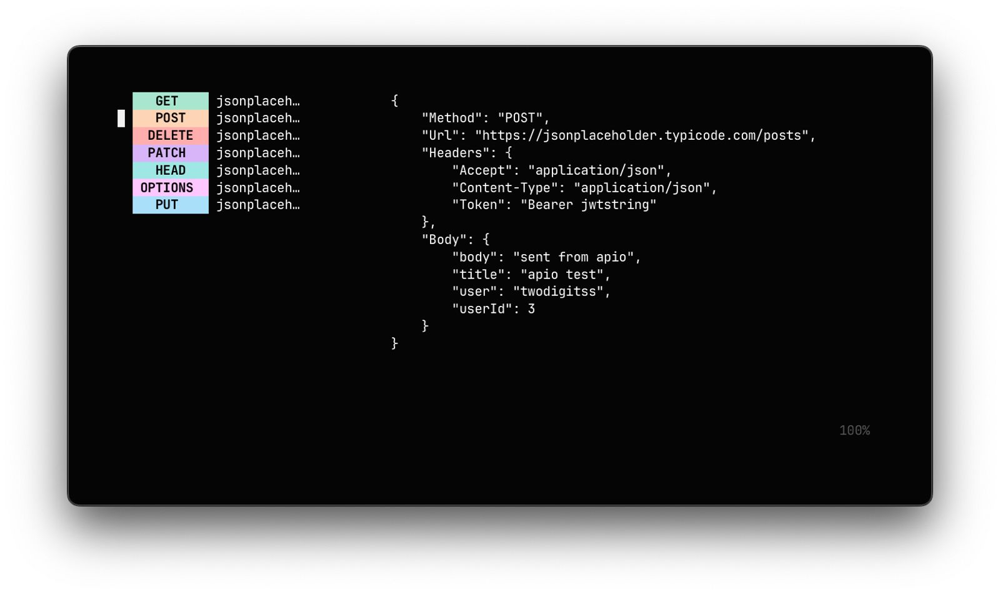

# 🥬 Apio

> Minimalist HTTP file reader and runner for your terminal.

**Apio** is a TUI tool designed for developers who prefer defining HTTP requests in plain text files (such as `.http` or `.rest` files) rather than using heavy GUI clients.

There is similar tools, such as Posting and Noodle, but i tried to focus on just reading and executing because i dont actually want to build a TUI Postman.
Apio reads your HTTP files, parses and extracts the requests, and lets you execute them interactively inside a Terminal. *apio is a reader/executor; it does not modify your files.*




---

## Instalation
Run `./build.sh` to build the binary and `./build.sh install` to install it locally at `~/.local/bin/apio`

If you choose to install it locally, run `apio` to start<br>
Note: make sure there is at least one http file on the working directory you are executing the command.


---

## Keybindings

Navigating and running requests in `apio` is straightforward:

| Key | Action |
| :--- | :--- |
| `↓` / `j` | Select the next request |
| `↑` / `k` | Select the previous request |
| `Enter` | Execute the selected request |
| `y` | Copy the response body to clipboard |
| `r` | Reload the HTTP files from disk (on-demand sync) |
| `c` | Clear the response (returns view to request details) |
| `f` | Select a different HTTP/REST file (if multiple files exist) |
| `h` / `?` | Toggle help screen |
| `q` / `Ctrl + C` | Quit apio |

---

## Supported `.http` File Format

`apio` supports standard plain-text HTTP client syntax. For example:

```http
### Global variables
@api = jsonplaceholder.typicode.com
@contentType = application/json

### Get a post
GET https://{{api}}/posts/1
Accept: {{contentType}}

### Create a new post
POST https://{{api}}/posts
Content-Type: {{contentType}}
Token: Bearer your-jwt-token-here

{
  "title": "Testing apio",
  "body": "Sent from the terminal",
  "userId": 1,
  "api": {{api}}
}
```

---

## License

This project is licensed under the MIT License - see the [LICENSE](LICENSE) file for details.

---

Contributions, issues, and pull requests are highly welcome to help improve the parser and parser coverage!


