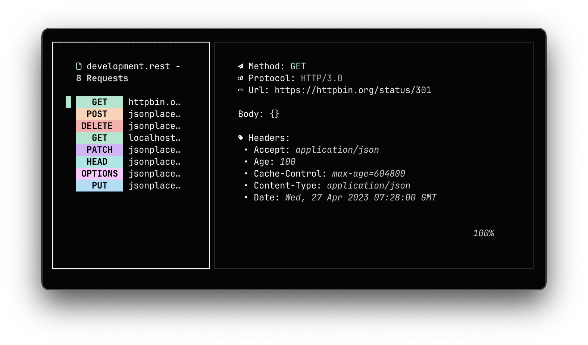
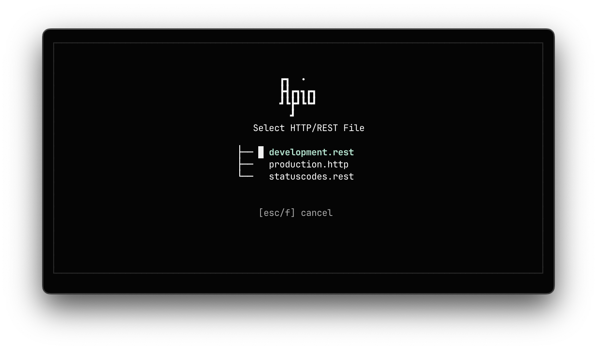
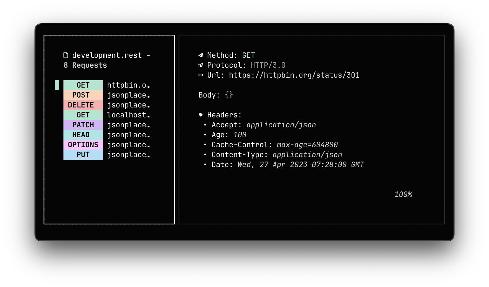
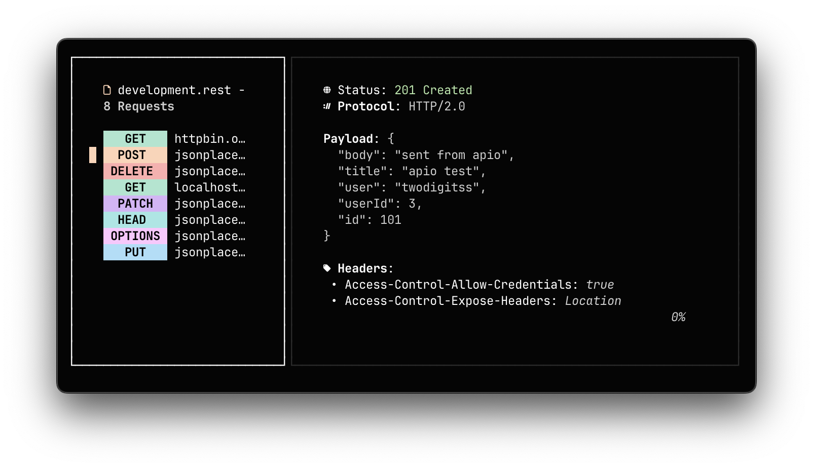
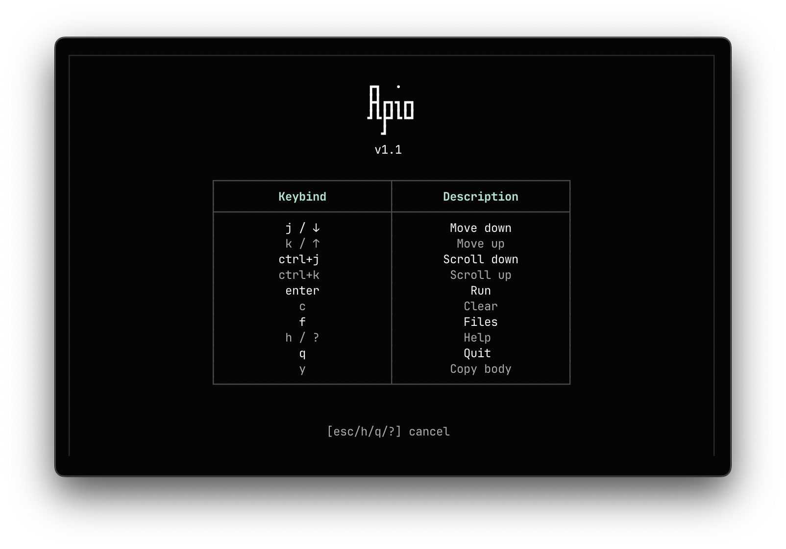

# 🥬 Apio

> Minimalist HTTP file reader and runner for your terminal.

**Apio** is a lightweight and minimal TUI tool designed for developers who prefer defining HTTP requests in plain text files (such as [`.http` or `.rest` files](https://http-files.org/)) rather than using heavy GUI clients.

There is similar tools, such as Posting and Noodle, but i tried to focus on just reading and executing `http` files because i dont actually want to build another TUI Postman.
Apio lets you execute your HTTP files interactively inside a Terminal.



---

## Installation

Run `./build.sh` to build the binary. <br/>
Run `./build.sh install` to install it locally at `~/.local/bin/apio`

Once done, run `apio` to start<br>
Note: make sure there is at least one http file on the working directory you are executing the command.

---

## Keybindings

Navigating and running requests in `apio` is straightforward:

| Key              | Action                                                      |
| :--------------- | :---------------------------------------------------------- |
| `↓` / `j`        | Select the next request                                     |
| `↑` / `k`        | Select the previous request                                 |
| `Ctrl` + `k`     | Scroll up the response pane                                 |
| `Ctrl` + `j`     | Scroll down the response pane                               |
| `Enter`          | Execute the selected request                                |
| `y`              | Copy the response body to clipboard                         |
| `c`              | Clear the response (returns view to request details)        |
| `f`              | Select a different HTTP/REST file (if multiple files exist) |
| `h` / `?`        | Toggle help screen                                          |
| `q` / `Ctrl + C` | Quit apio                                                   |

No need to reload manually anymore. It automatically reloads when you change the HTTP file.

---

## Supported `.http` / `.rest` File Format

`apio` supports standard plain-text HTTP client syntax. For example:

```http
### Global variables
@api = jsonplaceholder.typicode.com
@contentType = application/json

### Get a post
GET https://{{api}}/posts/1
Accept: {{contentType}}

### Create a new post
POST https://{{api}}/posts
Content-Type: {{contentType}}
Token: Bearer your-jwt-token-here

{
  "title": "Testing apio",
  "body": "Sent from the terminal",
  "userId": 1,
  "api": {{api}}
}
```

---

## Customization

If you run `./build.sh install`, a TOML config file will be generated in your config directory:

- `~/.config/apio/config.toml`.

You can customize some aspects of Apio, such as:<br/>

- Sidebar positioning (left or right)
- Enable/disable glyphs (Any [nerd font](https://www.nerdfonts.com/font-downloads) is required to display icons)
- Enable/disable borders
- Colors.

Do not delete the file (please).

---

## More images






---

## License

This project is licensed under the MIT License - see the [LICENSE](LICENSE) file for details.

---

Contributions, issues, and pull requests are highly welcome to help improve the parser and parser coverage!
